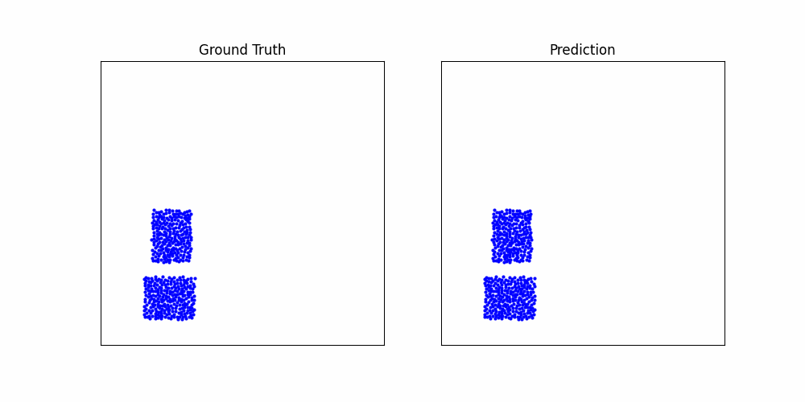

## Download dataset
```shell
bash download_dataset.sh {dataset_name} ./datasets
```
Here `{dataset_name}` is one of the datasets following:
- WaterDrop
- Water
- Sand
- Goop
- etc.

## Transform dataset into .pkl file
```shell
python transform_to_pkl.py --dataset {dataset_name} --split {split}
```
Here `{split}` is one of `train, test, valid`.

## Train a model.
```shell
python main.py --mode train --dataset {dataset}
```

## Evaluate.
- Evaluate one_step loss.
```shell
python main.py --mode eval --eval_split {split}
```
- Evaluate rollout loss.
```shell
python main.py --mode eval_rollout --eval_split {split}
```

## Render rollout.
```shell
python render_rollout.py --rollout_path rollouts/Water/gcn/rollout_test_0.pkl
```

If using `GAT` as our GNN backbone, we can get the following simulation effect on `Water`:



## Citation

The original work was done by [DeepMind](https://github.com/deepmind/deepmind-research), written in TensorFlow and published at ICML2020.

```shell
@article{DBLP:journals/corr/abs-2002-09405,
  author    = {Alvaro Sanchez{-}Gonzalez and
               Jonathan Godwin and
               Tobias Pfaff and
               Rex Ying and
               Jure Leskovec and
               Peter W. Battaglia},
  title     = {Learning to Simulate Complex Physics with Graph Networks},
  journal   = {CoRR},
  volume    = {abs/2002.09405},
  year      = {2020},
  url       = {https://arxiv.org/abs/2002.09405},
  eprinttype = {arXiv},
  eprint    = {2002.09405},
  timestamp = {Mon, 02 Mar 2020 16:46:06 +0100},
  biburl    = {https://dblp.org/rec/journals/corr/abs-2002-09405.bib},
  bibsource = {dblp computer science bibliography, https://dblp.org}
}
```

